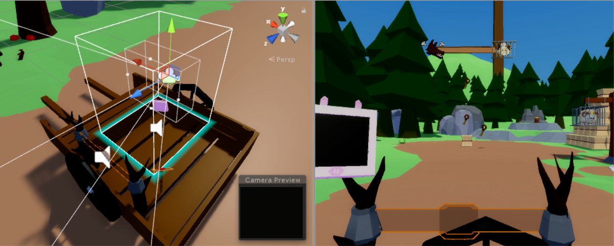
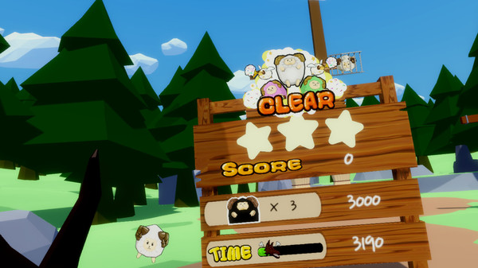
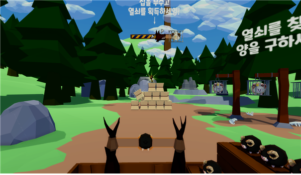
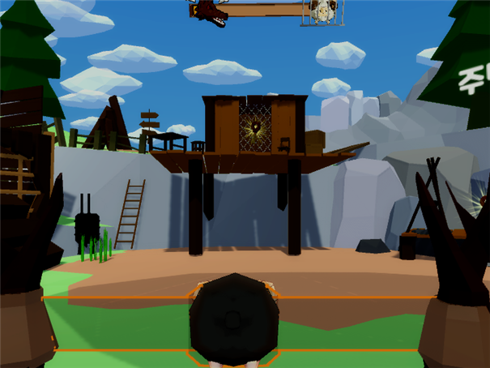
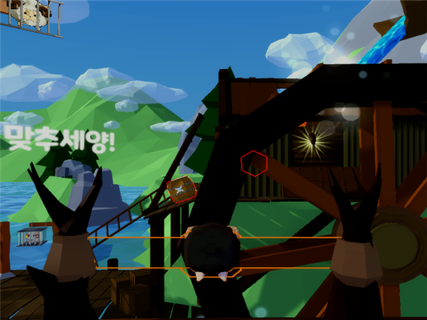

# Sheep-Sling
******************************************************************************************
<article>
#Team : Team.EO 
#Team Member : 1 Game Designer, 3 Programmer 
#Develop Period : 2017/10/21~2018/06/26 
#Publish : 2018/09/27 
#Platform : PC 
#Genre : 3D VR Shooting Puzzle Game 
#Link : https://store.steampowered.com/app/918440/SHEEP_SLING/ 
</article>

<body>
  <section>
    <h2>요약</h2>
    

      "Sheep-Sling"은 나쁜 늑대에게 빼앗긴 양들을 다시 찾아오기 위한 양치기와 검은 양의 모험을 담은 이야기 입니다. 
      플레이어의 목표는 수레에 있는 거대한 새총을 활용하여 검은 양을 발사해 양들이 잡혀있는 철장의 열쇠를 찾도록 하는 것입니다.      
      해당 게임의 제작은 전적으로 팀원들과 이루어졌고 VR컨텐츠 제작 기업인 "자몽"사의 멘토링을 통해 게임성을 높여 현재 대구 VR카페들에 유통되거나 Steam에 판매가 되고 있습니다.  
      작성자는 현 프로젝트에서 프론트엔드 개발위주로 게임내에 진행되는 상황을 판단하고 최종 결과를 출력하는 결과창과 레벨디자인, 각 레벨의 필요한 퍼즐 요소의 소소한 프로그래밍, 사용되는 소품들의 프로그래밍을 작업 하였습니다. 
    

  </section>
  
  <section>
  <h2>역할</h2>
    <ol>
      <li><b>VIVE 연동</b> 
      - 컨트롤러를 통한 상호작용 적용 (WandController.cs) 
      
      </li>
      <li><b>결과창 제작</b> 
      - 남은 시간에 비례한 점수/구출한 양의 점수/속도에 따른 충돌로 발생하는 점수 등 
      - 각 점수를 종합하여 일정시간 안에 어느정도 표시해주는 점수판 구현 (Script\Score_Board\_Score_Change.cs, Script\Score_Board\_Clear_Manager.cs) 
      
      </li>
      <li><b>각 맵 및 레벨디자인</b> 
      - 각종 맵에 필요한 퍼즐요소를 위한 간단한 스크립트 
      - 에셋을 활용한 맵 디자인 및레벨 디자인 
      
      
      
      </li>
      <li><b>시각적 효과 생성</b> 
      - 각종 파티클 시스템에 필요한 텍스쳐 및 머테리얼 제작 
      - 간단한 3D 모델 모델링 
      </li>
  </ol>
  </section>
  
  <h2>소개영상</h2>
</body>
<iframe width="640" height="360" src="https://www.youtube.com/embed/6Az2cNU7gUw" frameborder="0" gesture="media" allowfullscreen=""></iframe>

